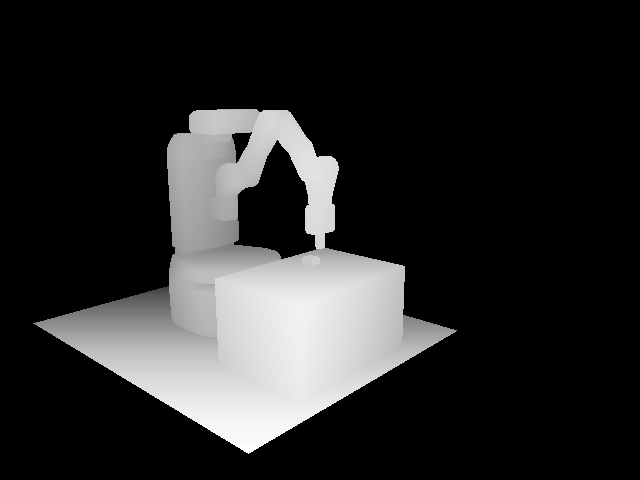
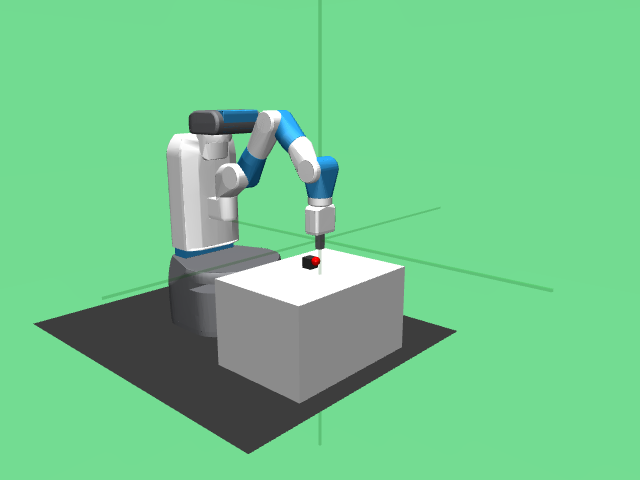

requires `gym-fetch`. Run:

```
pip install gym-fetch
```

```python
env = gym.make('fetch:PickPlace-v0')
env.reset()

image, depth = env.render('rgbd', width=640, height=480)


far = 4
depth[depth > far] = far
row.figure(depth, f"{Path(__file__).stem}/depth.png", normalize=True)
row.figure(image, f"{Path(__file__).stem}/rgb.png")
```

|  |  |
|:-------------------------------------------------------------------:|:---------------------------------------------------------------:|

The camera intrinsics are 
```python
The camera intrinsics are """:
    doc.print('')
```

```
```
